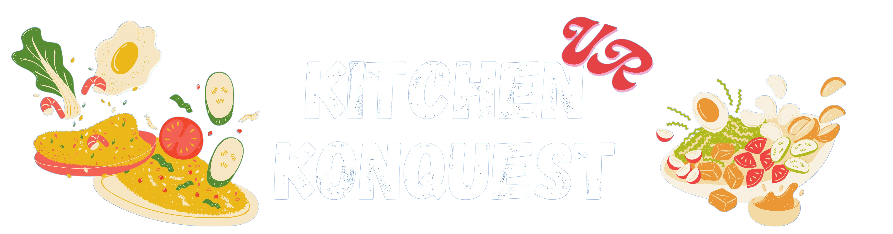
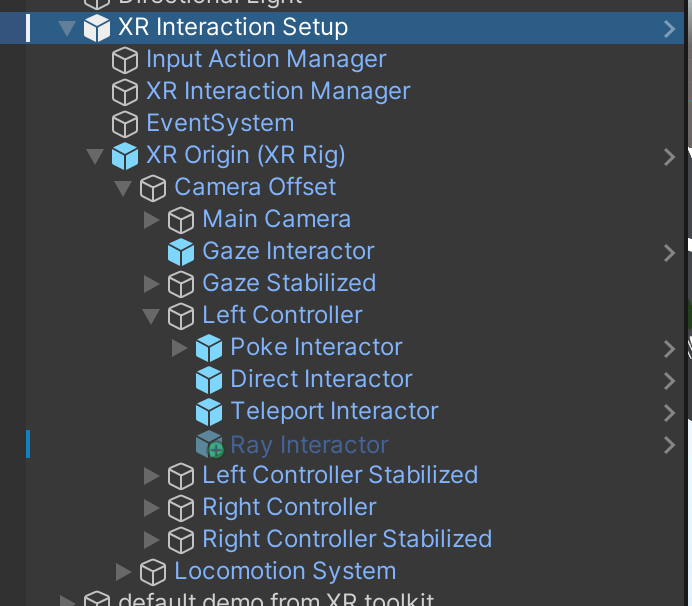
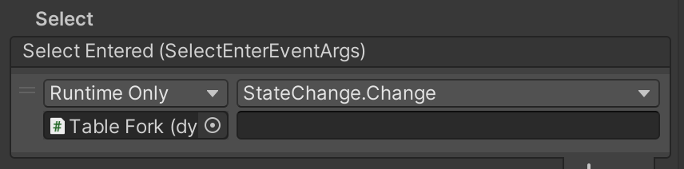
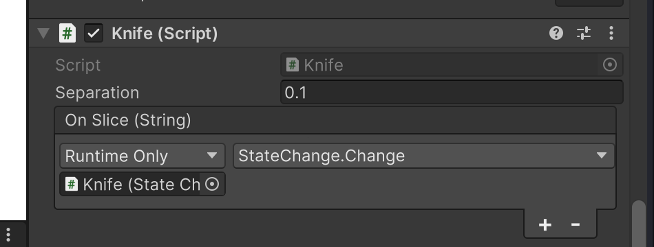

# VR Project!
This is using Unity version 2022.3.17f1

This is a VR project created for a VR class :3

## Assets Used

Asset name (folder in Assets) - description

- [XR Interaction Toolkit](https://docs.unity3d.com/Packages/com.unity.xr.interaction.toolkit@3.0/manual/index.html) (Samples/XR Interaction Toolkit) - base toolkit for developing XR apps for Meta Quest in Unity
- [TextMeshPro](https://docs.unity3d.com/Manual/com.unity.textmeshpro.html) (TextMesh Pro) - Text formatting and layout
- [Quick Outline](https://assetstore.unity.com/packages/tools/particles-effects/quick-outline-115488) (QuickOutline) - Used for outlining objects
- [EzySlice](https://github.com/DavidArayan/ezy-slice) (EzySlice) - Used to slice meshes using a plane
- [Food Props](https://assetstore.unity.com/packages/3d/food-props-163295) (AddOns/Mg3D\_Food) - Simple food objects, from official Unity Assets
- [Simple Foods](https://assetstore.unity.com/packages/3d/props/food/simple-foods-207032) (AddOns/Simple Foods) - More food models that includes both cooked and uncooked versions of the foods, from official Unity Assets
- [HQ Kitchen Rusty Knife](https://assetstore.unity.com/packages/3d/props/weapons/hq-kitchen-rusty-knife-83994) (CustomShapes/blender/knife.blend) - Used as a base model for the knife, applied custom materials
- [Frying in a pan](https://pixabay.com/sound-effects/frying-in-a-pan-6017/) (Sounds/frying.wav) - Frying pan sound effect
- [Switch sound effect](https://pixabay.com/sound-effects/switch-150130/) (Sounds/switch.wav) - Switch sound effect
- [Oven fan sound](https://pixabay.com/sound-effects/oven-fan-kitchen-appliance-23690/) (Sounds/oven.wav) - Sound effect for oven being on
- [NoirMat Marble Pack Vol 1](https://assetstore.unity.com/packages/2d/textures-materials/noirmat-marble-pack-vol-01-128318) (NoirMarblePack01) - Texture for walls
- [PBR Tile Texture Floor](https://assetstore.unity.com/packages/2d/textures-materials/tiles/pbr-tile-texture-floor-36243) (pbr\_textures) - Texture for floor

# Blender Overview

All files from blender are stored in `Assets/CustomShapes`. This folder has 2 subdirectories: `blender` and `textures`. The `blender` folder is where all `.blend` files should be placed. The `textures` folder is where exported textures are placed (see below). All models imported into Unity should be in the main `CustomShapes` folder, in the FBX format.

- Export textures from Blender to Unity: https://www.youtube.com/watch?v=yloupOUjMOA

# Interactions Overview

## Character

The main character and setup will just be copied to other scenes, as it has everything needed already. Here's a rough outline of everything that it has:



The only thing that is disabled is the `Ray Interactor`. This is currently re-enabled only on pause mode using the following code:

```c#
[SerializeField]
private GameObject leftRayRef;

// ...And later
leftRayRef.SetActive(false);
```

where the `leftRayRef` references the disabled `Ray Interactor` object shown above.

**TODO: Make everything else non-interactable by the ray interactors except the UI**

## Game Master

The game master object is used as a global state machine. See the [test states](./Assets/Resources/test-states.txt) for a demo of the states. The text document will list out the states in the following format:

```
<state_name> [value]
```

Some states, such as the cutting action, need an additional value to qualify its state change (eg. we need to check for cutting a tomato and not a pear).

The game master will only increment the current state if the valid state change event gets triggered, and this is checked when called.

### Game Master Object

1. Create an empty game object (can be named anything but for this ex we will name it `Game Master`)
2. Add the `Game Master` script
3. Fill in the "State File" field with the name of the state file; this should be placed in the `Assets/Resources` folder, with the `.txt` extension -- however you do not need the extension for the field - see the guide on [Text Asset](https://docs.unity3d.com/Manual/class-TextAsset.html)
3. If you want to visually see the game state, create a UI Text element (on a UI panel - see the TestScene) and attach it to `Game Master` script

For each object that is the target of a state update (ie. the fridge door opening or the grabbing of a specific object), you will need to attach the `State Change` script. You need to assign the `Game Master` object to the "Game Master" field and put the state name in the "State Name" field. Note that this state name needs to match the names you put in your state file.

The `State Change` script has a `Change` string function that can be called. This is how you send a change event to the game master object. This can be called in many different ways; here are a few:

### Other Objects that Change State

**Grabbable Object**

Add the `State Change` script to the object. Under the `XR Grab Interactable` Script, under `Interactable Events` (at the very bottom), add the current object's state change script and called the Change function. Like the following example with a fork:



**Custom event on script**

As with above, I added the `State Change` script to the object. For the knife script, I added a custom event field:

```c#
[SerializeField]
private UnityEvent<string> onSlice;
```

and called it with

```c#
onSlice.Invoke(collision.gameObject.name);
```

I selected the `dynamic string` option (see [Dynamic calls](https://docs.unity3d.com/550/Documentation/Manual/UnityEvents.html)), with will programatically send a parameter (ex. the knife will pass whatever it cut as the parameter). Here's the configuration in the Unity UI:



**Call in script**

As with before, add the `State Change` script. Also add a custom script (here it's [DoorOpenDetection](./Assets/Scripts/DoorOpenDetection.cs)). With this script, we can just call the `Change` function from the script, passing in the value as a parameter:

```c#
GetComponent<StateChange>().Change("");
```

## Grabbable Objects

This basically just uses the `XR Grab Interactable` scripts. You can create a simple grabbable object using `GameObject > XR > Grab Interactable`. However, you simply need to add the `XR Grab Interactable` and `XR General Grab Transformer` to any given object.

## Knife (Mesh Cutting)

This interaction uses a library mainly (see above). The cut plane is currently determined by the plane of the knife. There is a small delay between cuts (to prevent glitching), but there is no limit on how small cuts can be (shoud fix).

The knife will cut all objects that have the `ingredient` tag on it. The `seperation` field on the script determines how far the 2 cut pieces will end up.

**TODO: Need to clean up objects that are cut and rename/recenter em**

## Fridge Door

There is a Door (just a rectangle) which has a [Hinge Joint](https://docs.unity3d.com/Manual/class-HingeJoint.html). This joint is configured with `Use Limits` checked and positioned on its hinge axis.

The handle is a custom object made in Blender (found [here](./Assets/CustomShapes/handle.blend)). This object is attached to the door using a [Fixed Joint](https://docs.unity3d.com/Manual/class-FixedJoint.html). The handle also has the required Grab Interactable scripts attached to make it grabbable. Note that the movement type **must be Velocity Tracking** otherwise it will not work right.

The actual fridge container is also a custom blender object ([Hollow Box](./Assets/CustomShapes/hollow-box.blend)) and has nothing special except for a mesh collider.

## Pause Menu

The pause menu listens for user input using the XRI Default [Input Actions](https://docs.unity3d.com/Packages/com.unity.inputsystem@1.0/manual/Actions.html), modified to add a menu button interaction (see the [input actions file](./Assets/Samples/XR%20Interaction%20Toolkit/2.5.2/Starter%20Assets/XRI%20Default%20Input%20Actions.inputactions)).

The menu is a canvas with text and button elements on it, which will have its position set to the user and its rotation set to where the user is facing, level with the player's vertical position.

## Ingredients

All ingredient objects need the following to work properly with cutting and cooking interactions:

- Tagged with the `ingredient` tag
- Mesh Collider with the `Convex` variable set to true
- State Change script with `Game Master` assigned
- Ingredient script with `Inner Material`, `Expected Pieces`, `Total Cooking Time`, and `Overcooked Time` set
- Outline script, with `Outline Color` set and `AudioClip` set to the button pop (done cooking sound)

